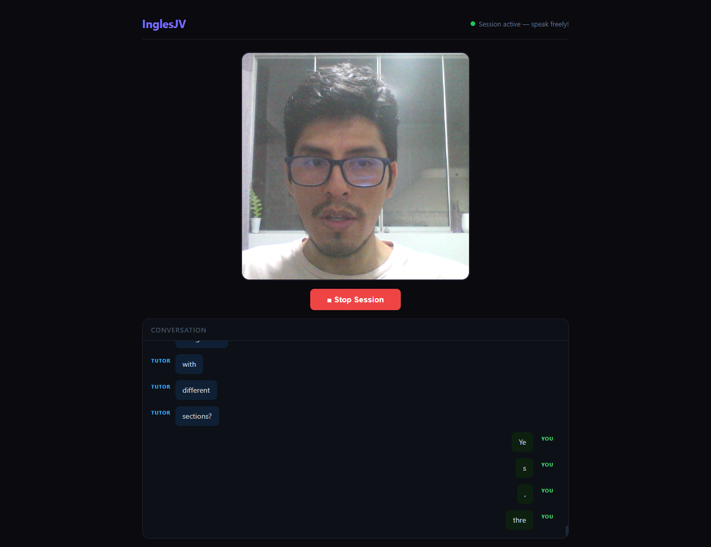

# InglesJV: Your AI-Powered Visual English Tutor 🇬🇧🤖

[](https://fastapi.tiangolo.com/)
[](https://www.python.org/)
[](https://aistudio.google.com/)
[](https://developer.mozilla.org/en-US/docs/Web/API/WebSockets_API)

**InglesJV** is a cutting-edge, multimodal English tutoring application that leverages the power of **Google Gemini 2.0** to provide an immersive, real-time language learning experience. Unlike traditional apps, InglesJV **sees and hears** you, using your environment to spark natural conversations and provide instant linguistic feedback.

---

## 🌟 Key Features

### 🎙️ Real-time Multimodal Conversation
Experience seamless voice interaction with Gemini. The app uses the **Multimodal Live API** to ensure low-latency responses, making your practice feel like a real conversation with a native speaker.

### 👁️ Visual Context Awareness
The AI tutor doesn't just listen; it observes. By analyzing your camera feed (frames processed in real-time), Gemini can:
- Suggest topics based on objects in your room.
- Ask questions about what you are doing.
- Help you name things in your surroundings.

### 🧠 Intelligent Pedagogical Approach
- **Dynamic Corrections:** Receive gentle grammar and pronunciation feedback directly in the transcript.
- **Vocabulary Building:** Learn new words related to your immediate context.
- **Level Customization:** Tailored for different proficiency levels (Beginner to Advanced).

### ⏳ Passive & Active Modes
- **Passive Mode:** Set intervals for the AI to "peek" and suggest a new conversation topic. Perfect for staying engaged throughout your day.
- **Active Mode:** Dive into full conversation sessions with live audio and video relay.

---

## 🛠️ Technical Stack

### Backend
- **Framework:** [FastAPI](https://fastapi.tiangolo.com/) (Asynchronous, high-performance Python web framework).
- **AI Integration:** [Google GenAI SDK](https://github.com/google/generative-ai-python) (Utilizing Gemini 2.0 Flash Multimodal Live).
- **Communication:** WebSockets for bidirectional, low-latency audio/video streaming.
- **Configuration:** Pydantic Settings for robust environment management.

### Frontend
- **Logic:** Vanilla JavaScript (ES6+) with a modular architecture.
- **Media:** HTML5 MediaDevices API (Camera/Microphone) and Canvas for frame capture.
- **Audio:** Web Audio API for real-time PCM playback.
- **Styling:** Custom CSS3 with a clean, "Dark Mode" aesthetic.

---

## 🚀 Getting Started

### Prerequisites
- Python 3.10+
- A Google AI Studio API Key ([Get it here](https://aistudio.google.com/))
- SSL Certificates (`cert.pem` and `key.pem`) for local HTTPS (required for camera/mic access in most browsers).

### Installation

1. **Clone the repository:**
   ```bash
   git clone https://github.com/your-username/Proyecto_InglesJV.git
   cd Proyecto_InglesJV/app
   ```

2. **Set up the virtual environment:**
   ```bash
   python -m venv .venv
   source .venv/bin/activate  # On Windows: .venv\Scripts\activate
   pip install -r requirements.txt
   ```

3. **Configure Environment Variables:**
   Create a `.env` file in the root directory (use `.env.example` as a template):
   ```bash
   GEMINI_API_KEY=your_actual_api_key_here
   ```

4. **Run the application:**
   ```bash
   cd backend
   python main.py
   ```
   The server will start at `https://localhost:8000`.

---

## 🛡️ Security & Privacy
- **No Data Storage:** Frames and audio are processed in real-time. Nothing is stored on the server or used for training unless explicitly permitted by your Google API settings.
- **Best Practices:** API keys are managed via environment variables and are never committed to the repository.

---

## 👨‍💻 Author
**Jean C.** - *Full Stack Developer & AI Enthusiast*
- LinkedIn: [Your Profile](https://www.linkedin.com/in/your-profile/)
- Portfolio: [your-portfolio.com](https://your-portfolio.com)

---
*Developed with ❤️ to bridge the gap in language learning using Generative AI.*

